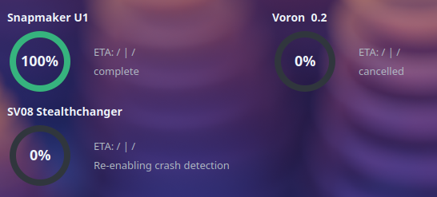

# 3D Printer Status Widget
This is a desktop widget for KDE Plasma that can show you the current state of your 3D Printers so you don't even need to open the Web-UI to see how far your print is.<br>
Your printer needs to run Klipper for this to work!



## Installation
Run these commands:<br>
```bash
mkdir -p ~/.local/share/plasma/plasmoids/com.lokiscripts.printers
git clone https://github.com/lokileiche/3Dprinter-status-widget.git ~/.local/share/plasma/plasmoids/com.lokiscripts.printers/
```

Now re-log or reboot to reload your desktop environment.<br>
Next, right-click on an empty space on your desktop and hit "Enter Edit Mode", at the top click "Add or Edit Widgets" and search for "3D-Printer Status". After you placed it on your desktop, right-click it and hit Configure Widget and add all your printers with their IP and a name.

## Problems
If you encounter any questions, have any problems or improvements, feel free to open an Issue or a PR.
